Code Contributions
====

Inflow Perturbation Methods
====

Several inflow perturbation methods were developed and examined within the Mesoscale-to-Microscale Coupling (MMC) project. The goal of these methods is to accelerate the formation and equilibration of resolved-scale turbulent flow features within large-eddy simulation (LES) domains driven by forcing or inflow that does not contain resolved-scale turbulence features explicitly. Inflow perturbations can significantly reduce the distance required for turbulence features to form and equilibrate to the extant forcing, leading to substantial reductions of computational costs by permitting the use of smaller domains, while simultaneously improving the physical accuracy of the solution in the area of interest.

Cell Perturbation Method 
----

This section describes our implementation of the Cell Perturbation Method (CPM) into the MMC version of the the Weather Research and Forecasting (WRF) model. This implementation encompasses several variants examined within the references, as well as some additional configurability, along with a few differences. Additional information about this specific implementation can be obtained from two files within the MMC WRF installation; Registry/registry.les_cpm, which describes the model variables, runtime configurability, units, and default values; and dyn_em/module_les_cpm.F, which contains the source code as well as descriptions of functionality in the header of each subroutine, along with descriptions and units for all variables. While this document describes our implementation into the WRF model, the same general algorithm can be applied to other LES models that also receive inflow information either from a mesoscale atmospheric simulation, or slow-response measurements that likewise do not contain resolved-scale turbulence motions. 

The CPM is a technique based on the application of perturbed values of state variables (temperature or velocity) to one or more "cells" (groups of one or more contiguous model grid points in the horizontal and vertical directions) located along one or more lateral boundaries of a computational domain. Optimal choices of the size, amplitude, and number of cells effectively seeds the inflow to an LES domain with resolved-scale variability at the proper scales and magnitudes to rapidly generate resolved-scale turbulence that is consistent with the large-scale forcing. The value of the perturbations are constant within each cell, and vary randomly from cell to cell within a target amplitude window.  

Figure 21 depicts a typical application of the CPM, following the approaches developed and used in many of the references. Here, perturbations (colored squares) are added instantaneously to the potential temperature field, around all four lateral edges of an LES domain, nested one-way within a bounding mesoscale domain (not shown), from which it receives lateral boundary information. The LES domains shown in this section are much smaller than would typically be used, with the purpose here to elucidate functionality and options. A sample subset of the namelist.input files that controls CPM characteristics is shown to the left of Fig 21 and those to follow. Our implementation provides default values for many of these control parameters, taken from the literature, but also provides flexibility to modify many of these parameters at run time, to facilitate optimization for various applications. These and other configuration parameters are described and exemplified in the remainder of this section.

.. _fig-cpm_1:
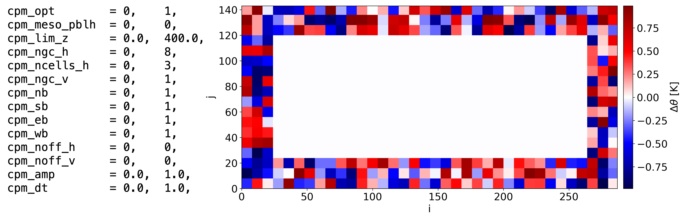

  Schematic of the CPM applied to potential temperature, with the standard 8X8 horizontal cell size, with 3 cells, around all four lateral boundaries, and a target amplitude window of [-1,1] K. 

The first line of text shows that the CPM is not used in the bounding domain (cpm_opt = 0 in column one, corresponding to the outermost WRF domain), and is used in the LES domain nested within it (cpm_opt = 1 in column two). Values of cpm_opt = 1 - 5 enable differences in the formulations and configurability of the CPM, which will be described further below.

The next two namelist entries cpm_meso_pblh and cpm_lim_z determine the height above the surface to which perturbations are applied. If cpm_meso_pblh = 0, cpm_lim_z determines the maximum height up to which to apply the perturbations. Setting cpm_meso_pblh = 1 instead uses the planetary boundary layer (PBL) height predicted by one of WRF's mesoscale PBL schemes. This option requires that cpm_meso_pblh = 1 on any domain using the CPM, as well as at least one bounding domain within which a mesoscale PBL scheme is used. In both case, the perturbations will be applied from the vertical index cpm_noff_z above the surface, up to and including the highest model grid level below a height equal to either 75% of the mesoscale PBL height for cpm_meso_pblh = 1, or to cpm_lim_z for cpm_meso_pblh = 0. Both the mesoscale PBL height and the height of the model vertical index used in these calculation are obtained using averages of all four lateral edges within each domain using the CPM. The slightly reduced height relative to the mesoscale PBL height prevents the triggering of anomalously strong mixing near the PBL top. When cpm_meso_pblh = 1, parameter cpm_lim_z instead specifies a minimum value to apply the perturbations, in the event that the mesoscale PBL scheme diagnoses a very shallow PBL, as sometimes occurs during stable conditions. 

The next four parameters cpm_nb, cpm_sb, cpm_wb and cpm_eb specify which among the the north, south, west and east boundaries, respectively, to apply the perturbations along, selected with a value of 1. Alternatively, if these parameters are all set to 0 (their default values), the boundaries to perturb will instead be selected automatically based on the lateral edge-averaged horizontal velocity components at the vertical grid index just below the height at which the wind is assumed to be approximately geostrophic. This height is taken to be 125% of either cpm_lim_z or the lateral edge average of cpm_meso_pblh. Perturbations are then applied to each lateral edge for which the flow is oriented into the domain. This option allows the edges being perturbed to change automatically over time with changes of the large-scale wind direction.

The next parameter cpm_amp specifies the target perturbation amplitude window. This value can be determined from among four options. Setting cpm_amp > 0.0 uses that value as the target, with each cell's value drawn from a uniform random number distribution, shifted to a zero mean, and scaled such that the range of values spans [-cpm_amp, cpm_amp]. If cpm_amp = 0.0 (the default value), the amplitude is instead determined automatically using one of the formulations specified by cpm_opt = 2-4, as described below.
 
Figures 22, 23 and 24 demonstrate some of the above-discussed configurability. For example, in Fig. 22 the perturbation zone contains smaller cells and more rows, while in Figs. 23 and 24 a smaller number of larger cells is specified, along with different boundaries and amplitudes. Note that in Figs. 21 and 22, the total numbers of grid points defining the domain extent, here [nx,ny] = [288,144] in the x- and y-directions, respectively, are divisible by cpm_ngc_h, with no remainder, resulting in cells of the same size along all boundaries. In contrast, Figs. 23 and 24 use values of cpm_ngc_h that do not divide evenly into ni or nj, leaving portions of cells equal to the remainder of ni or nj divided by cpm_ngc_h. In this implementation, the smaller cells occur at the north and east edges of the domains, since the tilings of the north and south boundaries begin at the west boundary, while those of the west and east boundaries begin at the south boundary. The order of the boundary tiling is west, east, south, then north, which results in the fractional cells appearing along different tilings at the east boundary edges in Figs. 23 and 24. One way to eliminate fractional cells is to ensure that cpm_ngc_h divides into ni and nj with no remainder.

.. _fig-cpm_2:
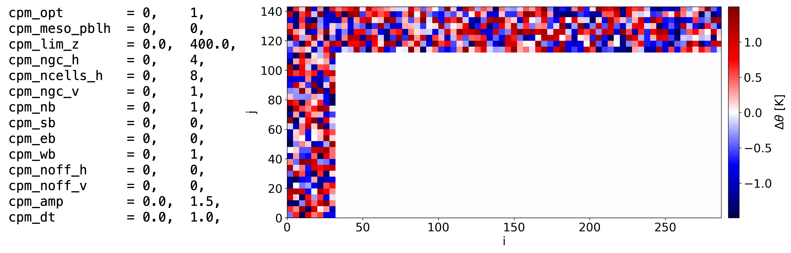

  CPM namelist parameters specifying a larger number of smaller cells, different boundaries, and a larger amplitude.

.. _fig-cpm_3:
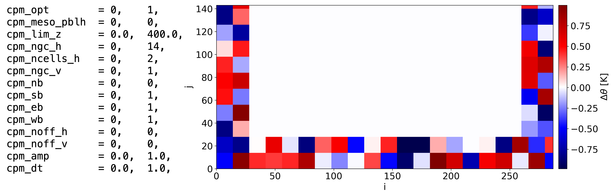

  CPM namelist parameters specifying a smaller number of larger cells, and different boundaries. 

.. _fig-cpm_4:
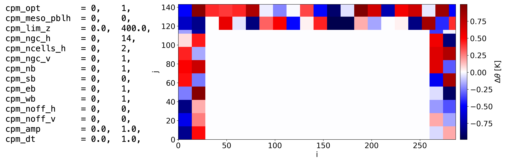

  CPM namelist parameters specifying the same tiling as for Fig. 23, but switching north and south boundaries. 

Figure 25 demonstrates three additional run-time options. One option is the automatic selection of which boundaries to perturb, chosen by setting cpm_nb = cpm_sb = cpm_eb = cpm_wb = 0. In this example featuring southwesterly flow, the south and west boundaries are selected. Another option shown here is how to stop the perturbations at a specified a number of grid points adjacent to any outflow boundary using cpm_off_h. This offset will be applied at any boundary that does not have perturbations applied, that is adjacent to a boundary that does. For demonstration, in Fig. 25, cpm_noff_h = 5, which leaves cells of width 3 grid points remaining along the north and east boundaries, since cpm_noff_h does not divide evenly into cpm_ngc_h. Such smaller cells can be eliminated by specifying compatible values of cpm_noff_h, cpm_ngc_h, ni and nj.

Figure 25 also demonstrates one option for automatic determination of the perturbation amplitude, cpm_opt = 2. This option bases the amplitude on the turbulent Eckert number, following Munoz-Esparza et al, 2014 and Munoz-Esparza et al, 2015. This formulation requires the magnitude of the geostrophic wind, the value of which is determined using the lateral edge-averaged horizontal wind components at the vertical grid cell index just below the height of the geostrophic wind, as used for the automated boundary selection option. The case shown in Fig. 25 used a geostrophic wind speed of 15 m/s, resulting in a target amplitude of approximately 1.1 K.

.. _fig-cpm_5:
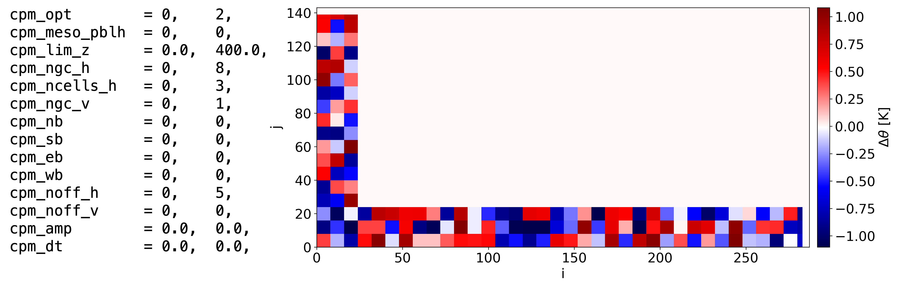

  CPM namelist parameters specifying automated determination of which boundaries to perturb, and the target amplitude. 

The next parameter cpm_dt determines the time interval in seconds at which new perturbations are applied. Specifying cpm_dt > 0.0 reapplies perturbations as soon as that time interval is exceeded, based upon the model time step, to all grid cells within the perturbation zone, cpm_ngc_h*cpm_ncells_h, at all lateral boundaries and at all heights to which the perturbations are applied. Figure 26 demonstrates this option, with cpm_dt = 30.0, showing x-z slices of potential temperature (top) and vertical velocity (bottom) after 5 minutes of simulated time. In this example, which features significant wind shear (geostrophic wind speed = 15 m/s), the value of cpm_dt is chosen as a compromise between the advective timescales of the perturbation zone near the surface versus farther aloft. For this strongly sheared case, the use of one timescale for all heights results in an overlapping of the cells near the surface, which compromises the performance of the method, while also yielding gaps in the potential temperature and vertical velocity variability above. 

.. _fig-cpm_6:
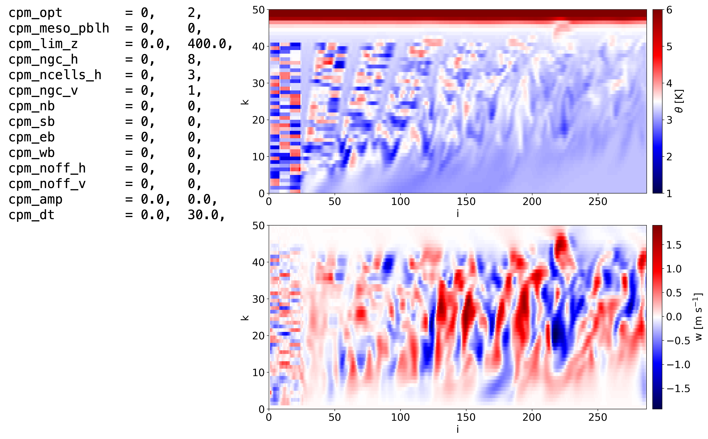

  Use of the specified perturbation refresh timescale leading to overlaps within and gaps between in the perturbations due to the vertical shear.

The overlapping within and gaps between the perturbations shown in Fig. 26 can be eliminated by setting cpm_dt = 0.0 (the default value), as shown in Fig. 27, which uses a height-dependent time interval based upon the advective timescale of the perturbation zone at the height of each slab. This timescale is computed as (1/a)*(cpm_ngc_h*n_cells_h - cpm_lambda*spec_bdy_width)*dh/ws. Here, dh is the model horizontal grid spacing, and ws is the wind speed averaged over the depth of the slab, along all four lateral edges. The term 1/a accounts for an increase of the advective timescale if the wind vector is not perpendicular to the cell, with a maximum value of a = sqrt(2) for flow oriented along the diagonal, while the factor cpm_lambda accounts for the effect of the relaxation zone, the number of grid cells adjacent to each lateral boundary over which the nested domain solution is either set to or blended with the bounding domain solution (spec_bdy_width). The default value of cpm_lambda = 0.5 assumes that the perturbations are diminished sufficiently to be negligible over one half of spec_bdy_width, and shortens the advective timescale slightly to account for the slightly reduced width of the perturbation zone. 

.. _fig-cpm_7:
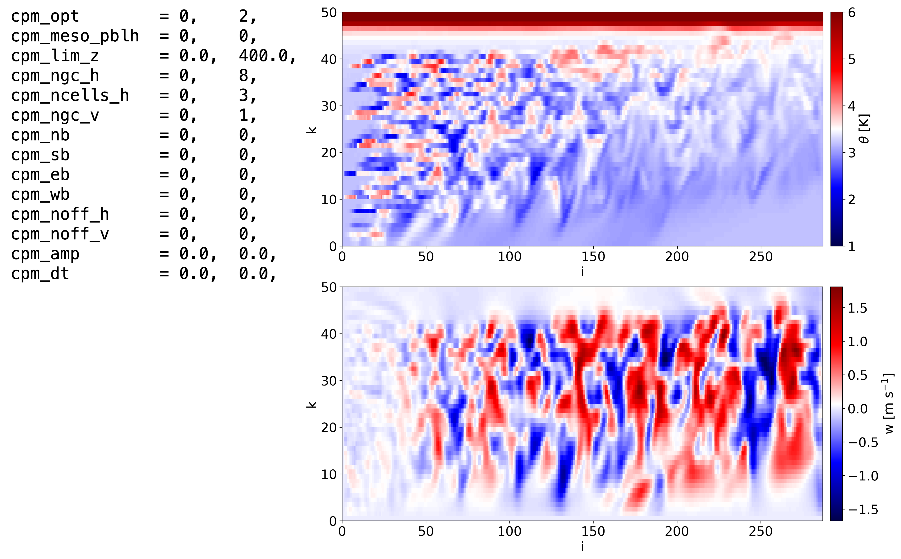

  Use of an automated perturbation refresh timescale, which eliminates the overlaps within and gaps between the perturbations shown in Fig. 25. 

Figure 28 demonstrates changes to the thickness of the perturbation slabs, using a value of cpm_ngc_v = 2 grid points, versus cpm_ngc_v = 1 (the default value) used in Fig. 27. The use of thicker slabs leads to larger amplitudes of resolved-scale features for both potential temperature and vertical velocity.

.. _fig-cpm_8:
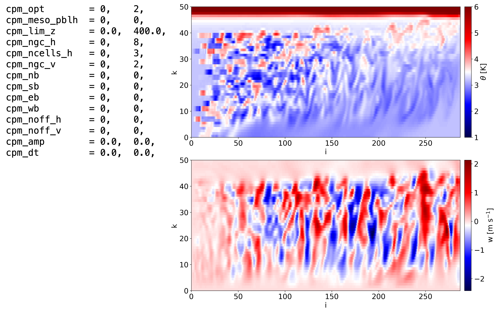

  As in Fig. 27, but using slabs with a depth of two grid points. 

Two other scaling formulations for the perturbation amplitude have been developed, following Munoz-Esparza and Kosovic, 2018. Figure 29 demonstrates a method intended for stable conditions, cpm_opt = 3, showing instantaneous X-Z slices of perturbation amplitude (top) and vertical velocity (bottom). This method uses a modified Richardson number, here shown with the default value of cpm_rim = -1.0. 

While difficult to discern, Fig. 29 shows a slight increase in the magnitude of the perturbations with height, above the decrease occurring over the lowest ten or so grid points. The vertical velocity shows a corresponding local maximum of variability near the height of the top of the perturbation zone. These features are due to the use of a stretched vertical grid in this setup, which increases the vertical grid spacing with height, rather than using a constant vertical grid depth as in the reference. The bulk CPM amplitude formulation uses vertical differences of wind speed and potential temperature, rather than gradients. Therefore, all else being equal (e.g. for constant vertical gradients), the cpm_opt = 3 formulation will compute larger vertical differences, hence larger perturbation amplitudes, with height as the grid cell depth increases. Therefore it is recommended to use constant vertical grid spacing with this option. 

.. _fig-cpm_9:
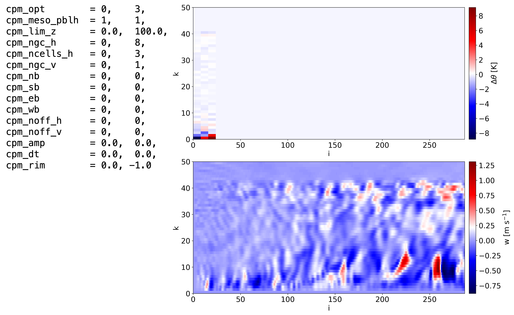

  Thermal perturbation magnitude (top) and vertical velocity (bottom) using a formulation for stable conditions.  

Figure 30 demonstrates a method intended for unstable conditions, cpm_opt = 4. This method requires specification of the surface sensible heat flux, which can either be set within the namelist using spec_hfx (shown here), or can use a value obtained from a mesoscale surface layer scheme, by selecting cpm_meso_hfx = 1. As with cpm_meso_pblh, the latter option requires that cpm_meso_hfx = 1 on at least one domain using a mesoscale surface layer scheme, as well as any LES domain using cpm_opt = 4.

.. _fig-cpm_10:
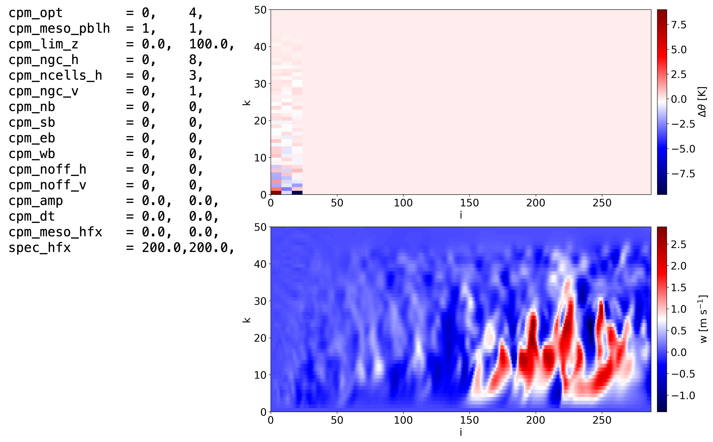

  Thermal perturbation magnitude (top) and vertical velocity (bottom) using a formulation for unstable conditions.  

The rationale for perturbing the potential temperature is to generate buoyancy accelerations that will rapidly form robust turbulence structures with consistent velocity correlations. However, cpm_opt = 5 allows the user to instead perturb the vertical velocity field directly. Figures 31 and 32 demonstrate this option, using slabs with depths of one and two grid points, respectively. As no established scaling for the amplitude of the vertical velocity perturbations has been developed, the value of cpm_amp = 3.5 m/s was chosen to reproduce a similar range of resolved-scale vertical velocity fluctuations as those produced using the Eckert number formulation shown in Figs. 26-28.

.. _fig-cpm_11:
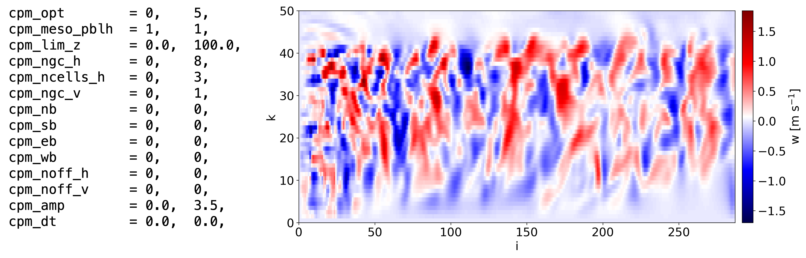

  Perturbing vertical velocity directly with a target amplitude window of 3.5 m/s, using slabs with a depth of one grid point. 

.. _fig-cpm_12:
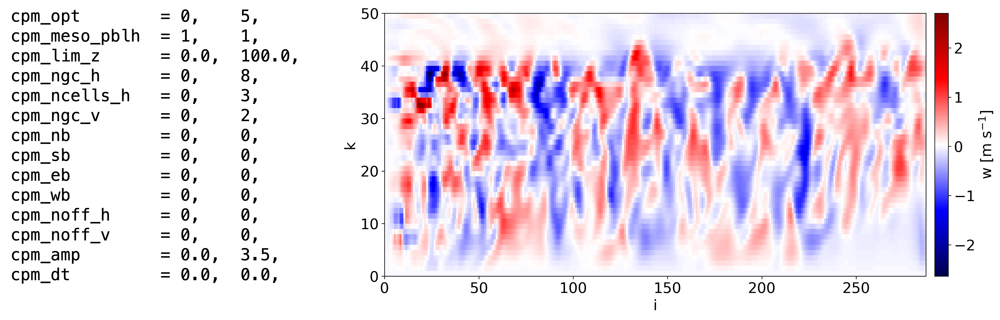

  Same as Fig. 31, but using slabs with a depth of two grid points. 

**DISCUSSION**

The implementation of the CPM described herein contains multiple options for idealized and real conditions, much of which has been tested and published. However, significant additional flexibility has been included, most of which remains untested. For example, the recommended cell sizes and number of rows were established using the Eckert number formulation of Munoz-Esparza et al 2014 and 2015, with a cell depth of one grid point. While the use of slabs of a depth of two grid points may yield slightly more rapid development of turbulence motions, the impact on the evolving turbulence field has not been established. The vertical velocity application implemented herein also differs from the approach of Mazzaro et al 2019, here applying the perturbations directly to the vertical velocity field, rather than through the forcing tendency as in the original formulation.

The expanded functionality of the MMC implementation of the CPM is intended to support further optimization of the approaches, including further examination of the physical dimensions of the cells, number of cells, amplitudes and refresh timescales, modified Richardson number, and other parameters, for given sets of forcing and landscape conditions. However, until the performance of any alternate configurations is established, it is recommended to use the default configuration settings from the publications cited.

Mann Method
----

TurbSim Method
----

Other methods
----
 

