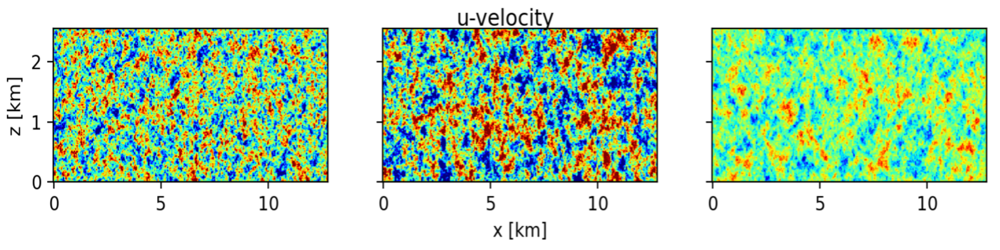
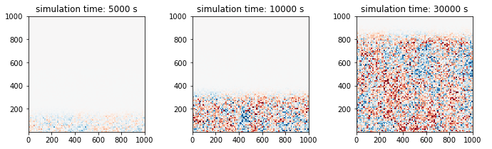

****************
Numerical Models
****************

Weather Research and Forecasting (WRF) Model
============================================
WRF is a tool for numerical weather prediction (NWP) developed at the National
Center for Atmospheric Research (NCAR), the National Oceanic and Atmospheric
Administration (NOAA), the former Air Force Weather Agency (AFWA), the Naval
Research Laboratory, the University of Oklahoma, and the Federal Aviation
Administration (FAA).

Running WRF in large-eddy simulation (LES) mode, nested within a mesoscale WRF
parent domain allows for online coupling between meso- and micro-scales.
WRF-LES implements a generalized actuator disk and generalized actuator line.

More information: https://www.mmm.ucar.edu/weather-research-and-forecasting-model

MMC-WRF
-------
Within the MMC project, several additions have been made to the WRF model for coupling and wind energy related processes.
Included in this version of WRF are several perturbation strategies, enhancements for running idealized cases, adjustments to the tslist functionality, and more.
This version is also tagged at various stages for particular studies.
If attempting to re-create results, please make sure you are running on the tagged version for the study of interest.

.. admonition:: Download MMC-WRF

   This version of WRF is freely available on GitHub: `MMC-WRF <https://github.com/a2e-mmc/WRF>`_

Community Survey
----------------
We conducted a survey to better understand how WRF is being used for
wind-energy applications. More specifically, the goal of the survey was to
provide guidance on best practices, identify aspects of model usage in need of
further investigation, and gain insight into barriers experienced by
wind-energy modeling teams in the use of WRF for their research.

For survey questions, results, and discussion including research opportunities,
see :cite:t:`Kaul2022`.

Simulator fOr Wind Farm Applications (SOWFA)
============================================
SOWFA is a set of CFD tools developed at the National Renewable Energy Laboratory (NREL) based on
the open-source OpenFOAM (Field Operation And Manipulation) platform for
simulating the microscale atmospheric boundary layer environment. Wind turbines
are modeled as actuator lines (or actuator disks) with the option to include
momentum sources to represent the wind turbine tower and nacelle. Coupling to
the NREL OpenFAST (Fatigue, Aerodynamics, Structures, Turbulence) model provides
comprehensive aeroservoelastic capabilities.  

More information: https://nwtc.nrel.gov/SOWFA

.. admonition:: Download SOWFA

   SOWFA is freely available on GitHub: `SOWFA-6 <https://github.com/NREL/SOWFA-6/tree/dev>`_. SOWFA-6 depends on `OpenFOAM-6 <https://github.com/OpenFOAM/OpenFOAM-6>`_. To use wind turbine aeroelastic coupling, `OpenFAST <https://github.com/OpenFAST/openfast>`_ is required.  

AMR-Wind
========
AMR-Wind is a massively parallel, block-structured incompressible LES for wind energy applications.
Based on the AMReX framework, it is well equipped to run on next-generation, leadership-class
supercomputers with CPU and/or GPU architectures. The software is under active development by
researchers at NREL, Sandia National Laboratories, and Lawrence Berkley National Laboratory. Like
SOWFA, AMR-Wind has the ability to perform profile assimilation and interface with `OpenFAST
<https://github.com/OpenFAST/openfast>`_ for aeroelastic modeling. It can also be coupled with
`Nalu-Wind <https://github.com/exawind/nalu-wind>`_, an overset near-body flow solver, amd behave as
a background solver.

More information: https://exawind.github.io/amr-wind/

.. admonition:: Download AMR-Wind

   AMR-Wind is freely available on GitHub: `amr-wind <https://github.com/exawind/amr-wind>`_.

Synthetic Turbulence Simulation
===============================
These simulators are used to accelerate the development of inflow turbulence.

Mann Method
-----------
The synthetic perturbation method applies the turbulence field along the inflow boundaries of the LES domain. The turbulence can be generated using any stochastic method, such as Mann :cite:p:`Mann1998`, TurbSim :cite:p:`turbsim`, etc. Herein, we describe the implementation of Mann synthetic turbulence in the WRF model to spin up the turbulence. The turbulence field is prepared separately from the WRF model using the empirical relation for the synthetic turbulence method. A homogeneous turbulent field (with a mean value of zero) is applied along the inflow boundary of the microscale domain at the prescribed frequency (e.g., 10 sec). This will instigate turbulence in the incoming wind as it progresses downstream from the boundaries.

The amount of turbulence in the Mann method is controlled by the length scale and the spectral energy scaling intensity as the input parameters. If observational data are available, the intensity of the turbulence can be adjusted by scaling the square root of the variances calculated from the observations. The turbulence should not be added above the boundary-layer depth. The vertical inflow plane added to the wind field at the microscale boundary is shown in :numref:`fig-mann_turb` for two-length scales and turbulence scaling intensities. The first and second panels are the u-velocity field created with a length scale of 100 m and 200 m with the identical scaling intensity factor of 50%. The third panel shows the u-velocity same as the second, but the scaling intensity factor is reduced to 10%. The amount of turbulence in the simulated field in the microscale domain depends on these inputs.

.. _fig-mann_turb:

  Inflow plane generated by the Mann method using length scale and scaling intensity of 100 m and 50% (left), 200 m and 50% (middle), and 200 m and 10% (right) 

TurbSim Method
--------------
TurbSim applies the Veers method :cite:p:`Veers1988` to generate time-varying homogeneous turbulent
inflow planes that are periodic in time. Inputs include either a modeled turbulence spectrum (e.g.,
the Kaimal model) or an input turbulent time history from which spectral amplitudes and phases can
be calculated. A tunable coherence model correlates the fluctuations of a particular velocity
component, between any two points on the inflow plane, as a function of their spatial separation.
Other parameters describing the synthetic turbulence include turbulence, integral-length, and
coherence scale parameters.

To account for nonstationarity and vertical heterogeneity, the simulated velocity fluctuations can
be scaled over time to match a known time history. Similarly, if information about the structure of
the ABL is known, the simulated velocity fluctuations can be scaled over height such that they are 0
in the free atmosphere. This information may be approximated by WRF PBL scheme outputs (``PBLH`` and
``TKE_PBL``) if available to produce inflow planes such as those seen in :numref:`fig-turbsim_turb`.

.. _fig-turbsim_turb:

  Inflow planes during a morning transition generated by TurbSim, using time-varying velocity
  variance and ABL height scaling

.. admonition:: Example code

    Example code for extracting TurbSim fluctuations offline for use with SOWFA or WRF-LES can be
    found in the `GitHub repo
    <https://github.com/ewquon/assessment/blob/master/studies/SWiFT/coupling_comparison/preprocessing/boundary/turbsim_to_velocity_perturbations.ipynb>`_.

An idealized verification study :cite:p:`Quon2018` showed that the addition of synthetic momentum
perturbations can reduce the fetch--the region over which turbulence develops on a finite
(aperiodic) domain--by a kilometer or more. The study used underresolved turbulence fields from a
coarse LES mesh (with 40 m spacing) as initial conditions and then compared the evolution of one-
and two-point statistics on a fine mesh (10 m), with and without perturbations. TurbSim and a
turbulence enrichment methodology (Gabor Kinematic Simulation) were both found to be similarly
effective in this study.

References
==========

.. rubric:: Resulting Publications

.. bibliography:: all_project_pubs.bib
   :filter: mmc_rtd_section % "modeling"

.. rubric:: Other

.. bibliography:: modeling_refs.bib

