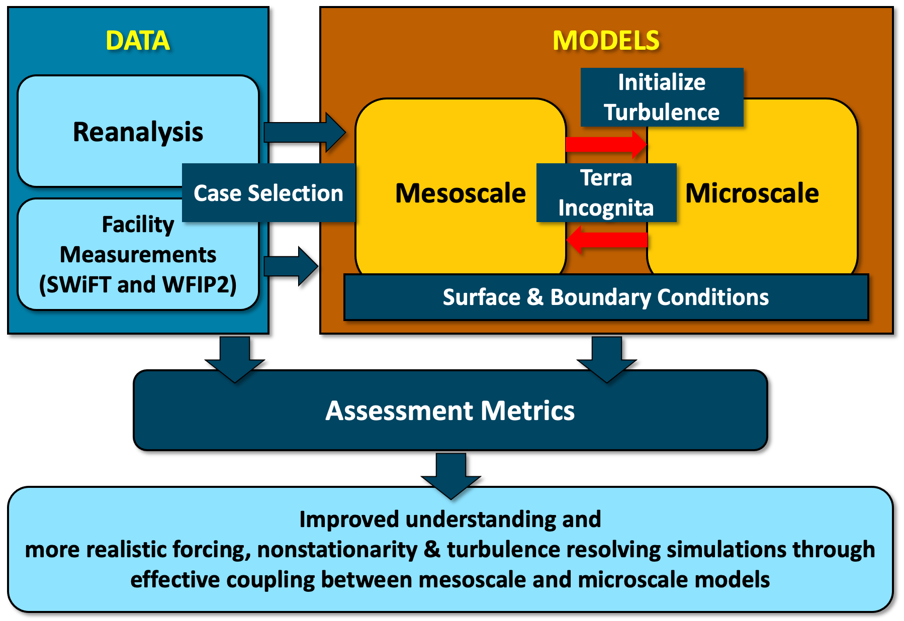

****************
Project Overview
****************

The Mesoscale to Microscale Coupling (MMC) Project was designed to build new high-performance-computing-based multiscale wind plant simulation tools coupling a broad range of scales.
The scale interactions enable the optimization needed to ensure the efficient, reliable production and integration of future wind-generated electricity.

.. admonition:: Technical Merit

  * Successful models of wind plants require forcing from the larger-scale atmospheric flow to capture the full range of energy-containing flow, including nonstationary motions
  * Integrating the full range of scales allows optimization of wind plant siting, design, and operation
  * The resulting tools will be applicable to diverse locations and operating conditions, as required to support wind energy integration at future high penetration levels

.. _fig-schematic:

  
  Schematic of the flow chart for the MMC Project.

Objectives
==========

* Establish a validation framework with well-defined performance metrics, and apply it to benchmark wind-plant simulation cases
* Improve the current state-of-the-science of coupling mesoscale information into high-fidelity HPC-based wind-plant simulations to reduce error in predicting wind speed and turbulence characteristics
* Disseminate methods with stakeholders
* Verify and Validate results using formal and reproducible techniques
* Quantify the uncertainty in the results

Participating Laboratories
==========================

* Pacific Northwest National Lab (PNNL; Lead Lab)
* Argonne National Lab (ANL)
* Lawrence Livermore National Lab (LLNL)
* Los Alamos National Lab (LANL)
* National Center for Atmospheric Research (NCAR; sponsored by National Science Foundation)
* National Renewable Energy Lab (NREL)
* Sandia National Lab (SNL)

Industry Symposium
==================

On September 14-15, 2022, the MMC team held an symposium, `MMC Methods to Meet the Wind Industry's
Needs <https://ral.ucar.edu/events/2022/mmc-methods-meet-wind-industrys-needs>`_.
Event recordings can be found on
`YouTube <https://www.youtube.com/playlist?list=PLl6YBMxdrM8liIyK8P5YntA0pg7kAR6V4>`_.

.. note::
  For more information, please see the `summary slides <https://www.energy.gov/sites/prod/files/2019/05/f63/T5%20-%20Haupt_0.pdf>`_ provied by Sue Haupt.

